# Kafka connect in Kubernetes

## Terraform

Login to Azure
```bash
az login
```

Deploy ADLS Gen 2 storage and Azure Kubernetes Service with the following commands:
```bash
terraform init
terraform plan -out terraform.plan
terraform apply terraform.plan
```

## Create a custom docker image

### Azure Container Registry

Create your Azure Container Registry https://docs.microsoft.com/en-us/azure/container-registry/container-registry-get-started-portal

Login
```bash
az acr login --name <registry-name>
```

Build your image and push it
```bash
docker build -f ./connectors/Dockerfile -t <registry-name>.azurecr.io/<image-name>:<tag> .
docker push <registry-name>.azurecr.io/<image-name>:<tag>
```

Attach the Azure Container Registry to Azure Kubernetes Service
```bash
az aks update -n <aks_resource_name> -g <aks_resource_group_name> --attach-acr <registry-name>
```

Get credentials for AKS cluster
```bash
az aks update -n <aks_resource_name> -g <aks_resource_group_name> --attach-acr <registry-name>
```


## Launch Confluent for Kubernetes

### Create a namespace

- Create the namespace to use:

  ```cmd
  kubectl create namespace confluent
  ```

- Set this namespace to default for your Kubernetes context:

  ```cmd
  kubectl config set-context --current --namespace confluent
  ```

### Install Confluent for Kubernetes

- Add the Confluent for Kubernetes Helm repository:

  ```cmd
  helm repo add confluentinc https://packages.confluent.io/helm
  helm repo update
  ```

- Install Confluent for Kubernetes:

  ```cmd
  helm upgrade --install confluent-operator confluentinc/confluent-for-kubernetes
  ```

### Install Confluent Platform

- Install all Confluent Platform components:

  ```cmd
  kubectl apply -f ./confluent-platform.yaml
  ```

- Check that everything is deployed:

  ```cmd
  kubectl get pods -o wide 
  ```

### View Control Center

- Set up port forwarding to Control Center web UI from local machine:

  ```cmd
  kubectl port-forward controlcenter-0 9021:9021
  ```

- Browse to Control Center: [http://localhost:9021](http://localhost:9021)

## Report

### Set up confluent platform in kubernetes

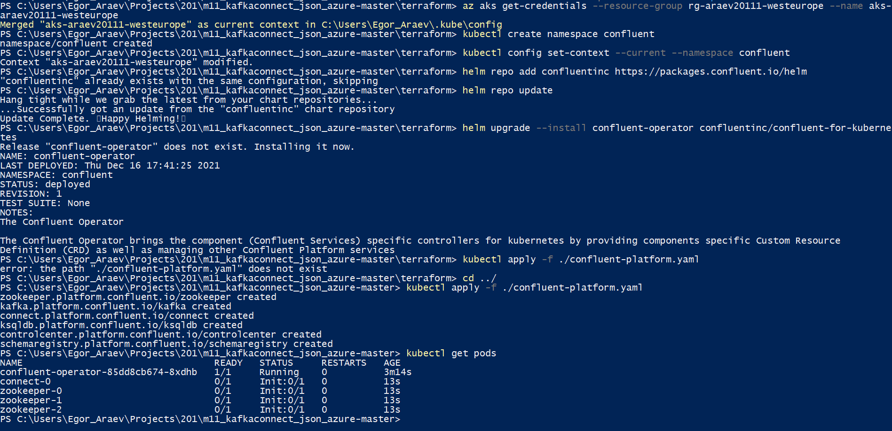

### See the pods running

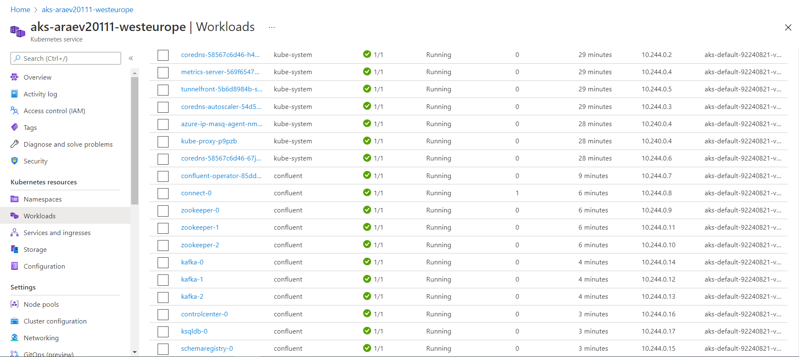

### View Control Center

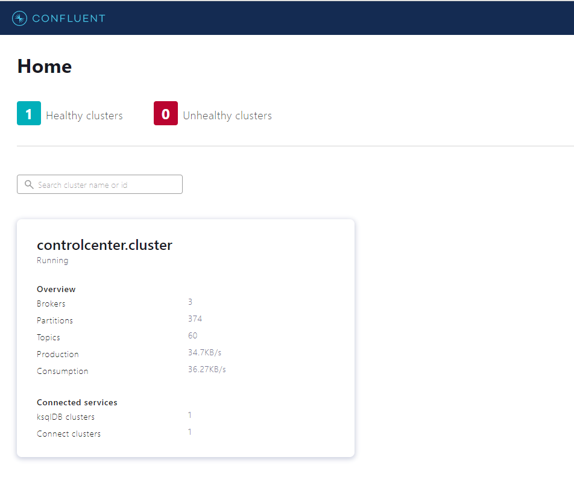

### Create 'expedia' topic with 3 partitions

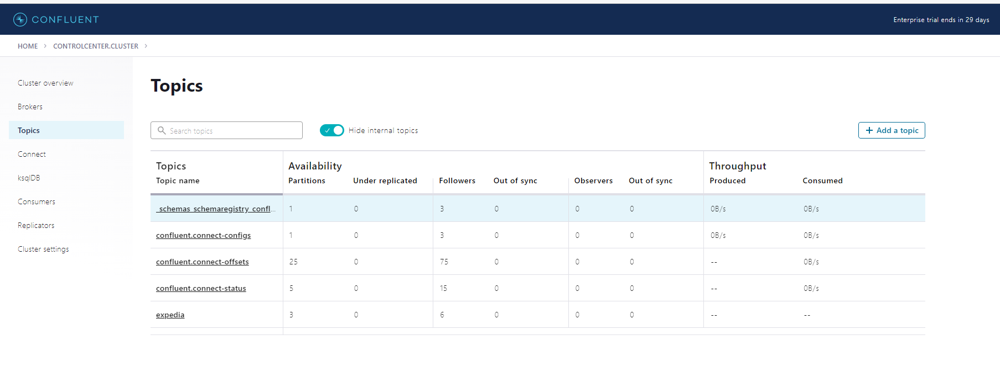

### Add source connector by uploading `connectors/azure-source-cc-expedia.json`

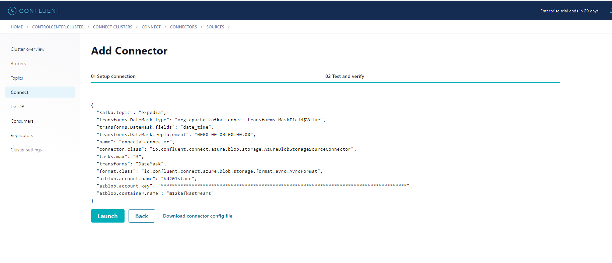

### See the connector running

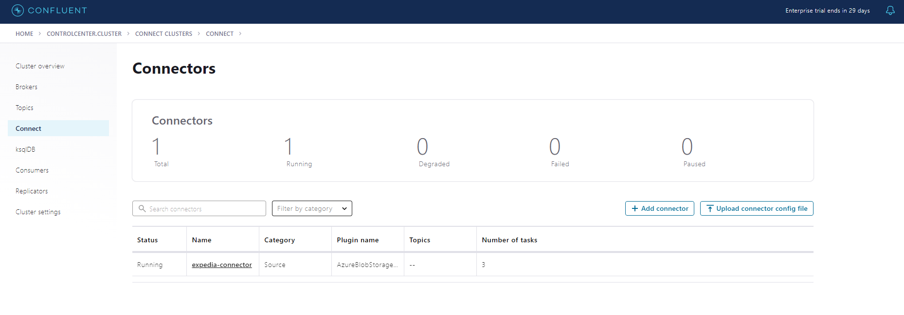

### Check the topic being populated with dates masked

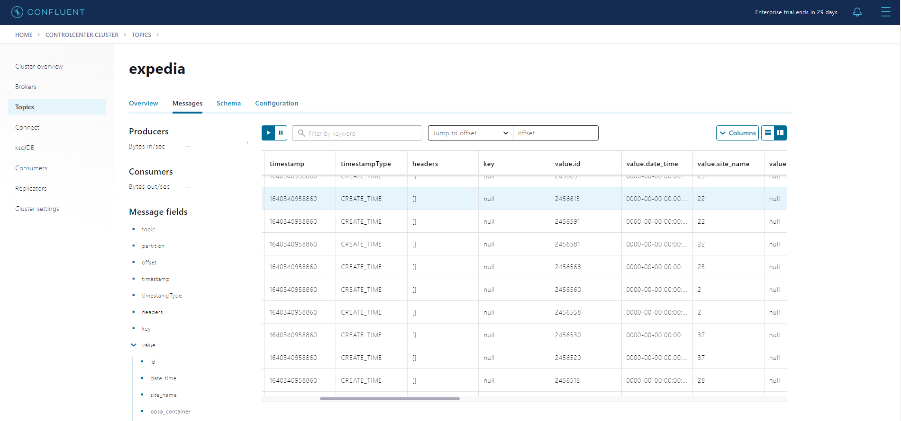

### Build jar with streaming app

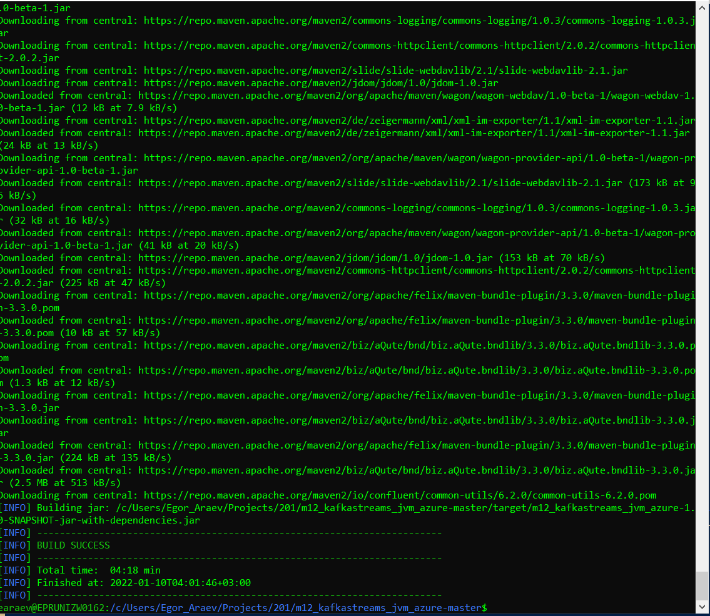

### Build and push docker container

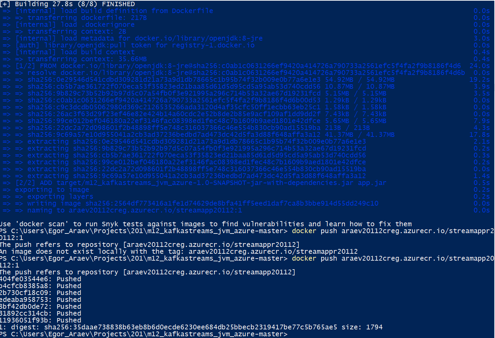

### Run `kubectl apply -f ./kstream-app.yaml`. See that there appeared a new consumer

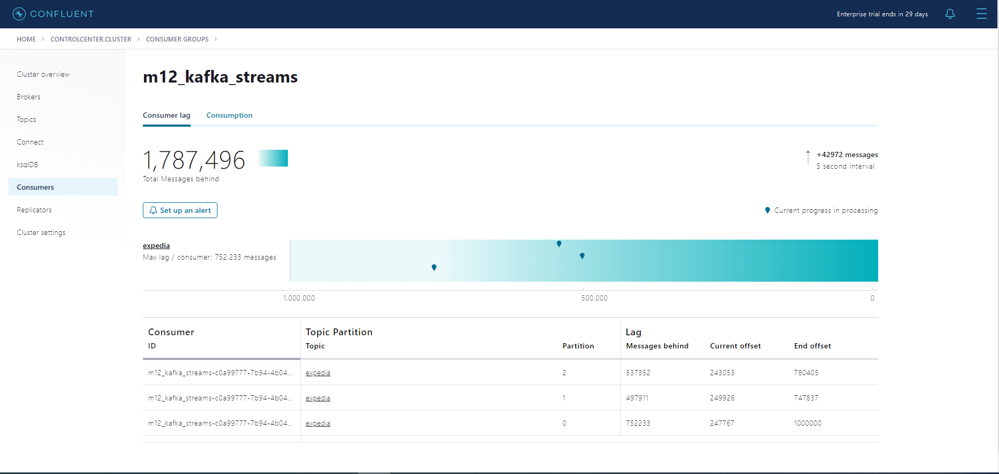

### Check that `expedia_ext` topic is being populated with enriched data

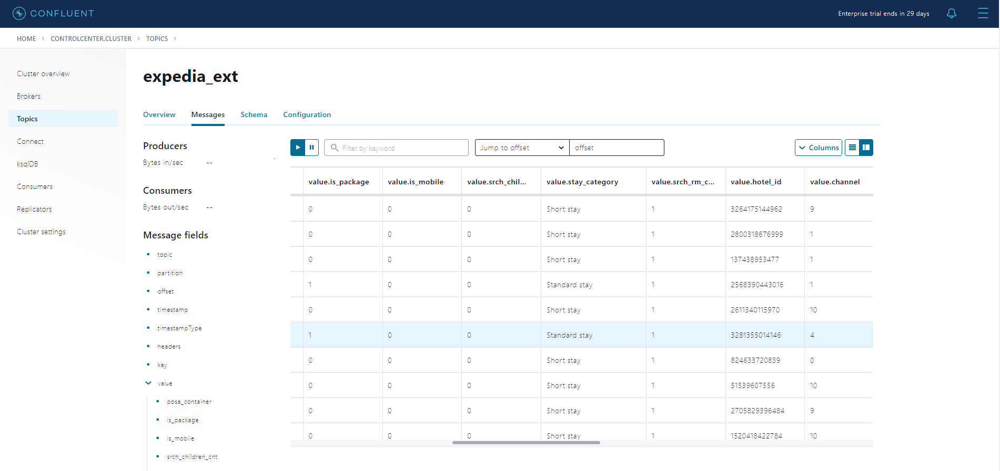

### Connect to ksqldb pod and create a stream and a table to query hotel counts

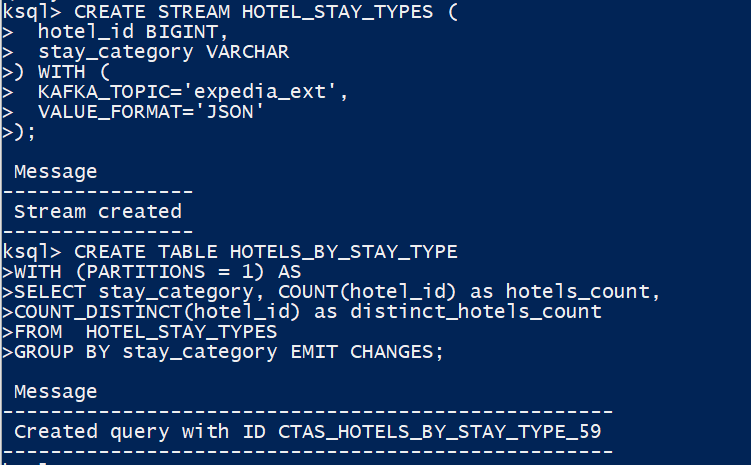

### Query the resulting table

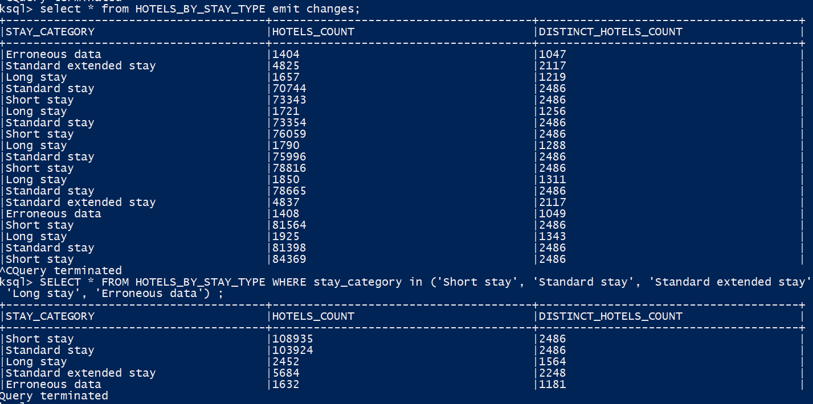

